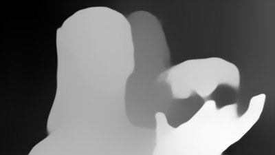

# monocular to mesh

3D mesh created from monocular using depth estimation

### Setup
```pip install -r requirements.txt```

### Usage
```python run.py -i <path_to_image>```

### Demo
  

(left: input source / right: output depth map)


(output mesh)